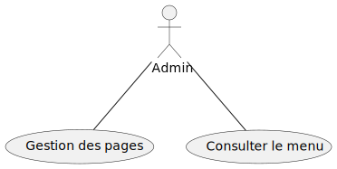

# Utilisation de package laravel-adminlte

## Objectif de lab 

- Utilisation de package "jeroennoten/laravel-adminlte"

## Travail à faire 

Réalisation d'une interface web pour la gestion de menu dynamique en utilisant le package "laravel-adminlte"

## Fonctionnalités 

## Base de données 

{: width="100px"}

